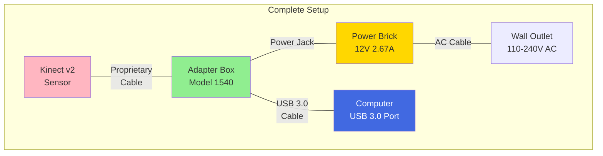

# Hardware Guide for OpenKinect v2

## Overview

This guide covers everything you need to know about the Xbox Kinect v2 hardware, including identification, requirements, setup, and technical specifications.

## Identifying Xbox Kinect v2

### Kinect v2 (Correct Version)
- **Model**: 1520 (Xbox One version)
- **Appearance**: Large, rectangular, glossy black
- **Sensors**: Three large lenses on front
- **Size**: Approximately 25cm × 6.5cm × 6.7cm
- **Logo**: "XBOX" branding on front

### NOT Kinect v1 (Wrong Version)
- **Model**: 1414 or 1473 (Xbox 360 version)
- **Appearance**: Smaller, horizontal bar design
- **Motor**: Has visible tilt motor base
- **Logo**: "KINECT" branding on front

## Required Components

### 1. Xbox Kinect v2 Sensor
The main sensor unit containing:
- 1080p RGB camera
- Time-of-flight depth sensor
- Infrared camera
- 4-microphone linear array
- 3-axis accelerometer

### 2. Kinect Adapter for Windows

**Essential** - The Kinect v2 cannot work without this adapter!

#### Official Microsoft Adapter
- **Model**: 1540 (recommended)
- **Includes**: Power supply and USB 3.0 converter
- **Power**: 12V @ 2.67A (32W)
- **Status LED**: White when powered

#### Why You Need the Adapter
- Kinect uses proprietary connector (not standard USB)
- Requires more power than USB can provide
- Converts proprietary protocol to USB 3.0

#### Where to Find
- Microsoft Store (discontinued but sometimes available)
- eBay/Amazon (used market)
- Third-party alternatives (risky - many don't work)

### 3. USB 3.0 Port Requirements

#### Minimum Requirements
- **USB 3.0** (USB 2.0 will NOT work)
- **5Gbps bandwidth** minimum
- **900mA power delivery** capability

#### Recommended USB Setup
- Use motherboard rear ports (not front panel)
- Avoid USB hubs or extensions
- Don't share controller with other high-bandwidth devices
- Blue USB ports are typically USB 3.0

#### Known Good Controllers
- Intel USB 3.0 controllers
- Renesas/NEC controllers
- AMD native USB 3.0

#### Known Problematic Controllers
- ASMedia ASM1042/ASM1142
- Some VIA controllers
- Older Fresco Logic controllers

## Connection Diagram

## Power Specifications

### Kinect Power Requirements
- **Voltage**: 12V DC
- **Current**: 2.67A
- **Power**: 32W
- **Adapter Input**: 100-240V AC, 50-60Hz

### USB Power Draw
- Still draws ~500mA from USB 3.0
- Some laptops can't provide enough power
- Desktop PCs generally work better

## USB Bandwidth Requirements

### Data Streams
- **Color**: 1920×1080 @ 30fps = ~120MB/s
- **Depth**: 512×424 @ 30fps = ~20MB/s  
- **Infrared**: 512×424 @ 30fps = ~20MB/s
- **Total**: ~160MB/s (requires USB 3.0)

### Why USB 2.0 Fails
- USB 2.0: 480Mbps (60MB/s theoretical)
- Kinect needs: 1.3Gbps (160MB/s actual)
- Result: "Insufficient bandwidth" errors

## Motherboard Compatibility

### For ASUS ROG STRIX B650-A
Best ports (from motherboard manual page 2-22):
1. **Rear USB 3.2 Gen 2 (Red)** - Ports 1, 2, 11
2. **Rear USB 3.2 Gen 1 (Blue)** - Secondary choice
3. **Avoid**: Front panel USB (power limitations)

### General Recommendations
- Check motherboard manual for USB controllers
- Use ports connected directly to chipset
- Avoid ports sharing bandwidth with M.2 slots
- Update motherboard BIOS for best compatibility

## Sensor Specifications

### RGB Camera
- **Resolution**: 1920×1080
- **Frame Rate**: 30fps
- **Field of View**: 84.1° × 53.8°
- **Operating Range**: 0.5m - 4.5m

### Depth Sensor
- **Technology**: Time-of-flight
- **Resolution**: 512×424
- **Frame Rate**: 30fps
- **Field of View**: 70.6° × 60°
- **Operating Range**: 0.5m - 4.5m
- **Depth Resolution**: ~3mm @ 2m

### Infrared Camera
- **Resolution**: 512×424
- **Frame Rate**: 30fps
- **Illumination**: Active IR with 3 emitters

### Microphone Array
- **Configuration**: 4-microphone linear array
- **Sampling**: 16kHz, 24-bit ADC
- **Beam Width**: Controllable via DSP (Windows only)
- **Linux**: Raw 4-channel capture only

## Environmental Requirements

### Operating Conditions
- **Temperature**: 5°C to 35°C
- **Humidity**: 20% to 80% (non-condensing)
- **Altitude**: Up to 3,000m

### Placement Guidelines
- Mount 0.6m - 1.8m above ground
- Clear view of play area
- Avoid direct sunlight on sensor
- Keep 0.5m minimum distance to subjects
- Stable mounting (no vibrations)

## Troubleshooting Hardware Issues

### Kinect Not Detected
1. Check adapter power LED (should be white)
2. Verify USB 3.0 connection (blue port)
3. Try different USB ports
4. Check Device Manager/lsusb

### Power Issues
- LED not lit: Check power connections
- LED blinking: Insufficient power
- Random disconnects: USB power problem

### USB Bandwidth Errors
- Close other USB 3.0 devices
- Use dedicated USB controller
- Update USB drivers/firmware
- Try USB 3.1/3.2 ports if available

## Buying Guide

### What to Look For
- Complete kit with sensor, adapter, and power
- White LED on adapter when testing
- Check for physical damage on lenses
- Verify model numbers match

### Red Flags
- "Works without adapter" claims (false)
- Extremely cheap third-party adapters
- Missing power supply
- Damaged/dirty sensor lenses

### Typical Prices (2024)
- Complete kit: $80-150 USD
- Sensor only: $30-60 USD  
- Official adapter: $50-80 USD
- Third-party adapter: $20-40 USD (risky)

## Care and Maintenance

### Cleaning
- Use microfiber cloth on lenses
- Avoid touching depth sensor lens
- No liquids or cleaning solutions
- Compressed air for dust removal

### Storage
- Keep in cool, dry place
- Protect lenses from scratches
- Store cables without sharp bends
- Keep original packaging if possible

### Longevity Tips
- Unplug when not in use
- Avoid frequent plugging/unplugging
- Ensure good ventilation
- Protect from power surges