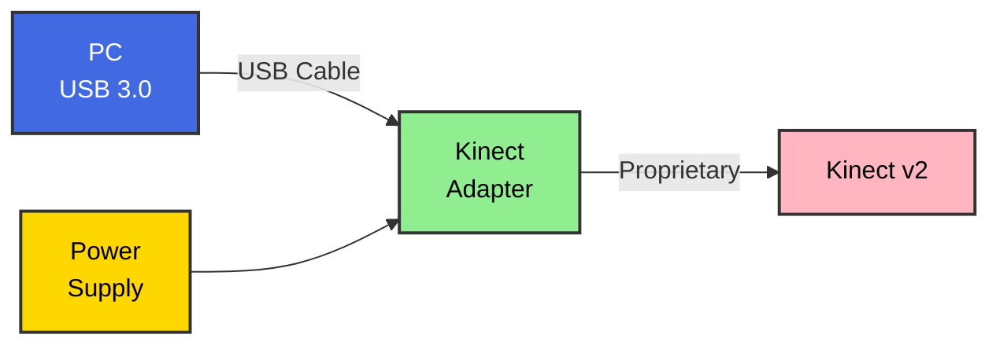

# OpenKinect v2

Complete Xbox Kinect v2 support for Linux - camera, audio, and everything in between.

## 🎯 What This Project Does

This project provides **complete Linux support** for Xbox Kinect v2, filling the gaps left by existing drivers:

- ✅ **Easy webcam setup** - Works with Zoom, Teams, OBS out-of-the-box
- ✅ **Software beamforming** - Directional audio with the 4-mic array
- ✅ **Audio enhancement** - Noise suppression, gain control, voice focus
- ✅ **Simple installation** - One-command setup with systemd integration
- ✅ **Real-time processing** - Low latency for video calls and streaming

## 🚀 Quick Start

```bash
# Clone and install
git clone https://github.com/BenGWeeks/openkinect-v2.git
cd openkinect-v2
./install.sh

# Start using Kinect as webcam
openkinect-v2 start

# Launch Zoom with Kinect
openkinect-v2 zoom
```

## 📸 Camera Features

- **1080p video** at 30fps
- **Direct V4L2 output** - no CPU-heavy conversions
- **Automatic service** - starts on boot
- **Works everywhere** - Zoom, Teams, Chrome, Firefox, OBS

## 🎙️ Audio Features

### Current (Basic USB Audio)
- 4-channel raw audio capture
- Very quiet (-20dB vs Windows)
- No directional processing

### Coming Soon (Software Beamforming)
- **Directional audio** - focus on speaker, reject noise
- **Auto gain** - normalizes quiet Kinect audio
- **Noise suppression** - reduces background sounds
- **Voice tracking** - follows active speaker
- **Low latency** - <20ms processing delay

## 📋 Requirements

### Hardware Setup



### Hardware Requirements
- Xbox Kinect v2 (Xbox One version)
- Official Kinect Adapter for Windows (provides power)
- USB 3.0 port (blue port, rear panel preferred)

### Software
- Linux kernel 4.4+ (Ubuntu 20.04+ recommended)
- libfreenect2
- v4l2loopback
- JACK audio (for beamforming)

## 🔧 Installation

```bash
# Install dependencies
sudo apt install libfreenect2-dev v4l2loopback-dkms jackd2

# Clone repository
git clone https://github.com/BenGWeeks/openkinect-v2.git
cd openkinect-v2/scripts

# Run installer
./install-kinect-v2.sh

# Enable service
sudo systemctl enable openkinect-v2
sudo systemctl start openkinect-v2
```

## 📁 Project Structure

```
openkinect-v2/
├── camera/          # Webcam functionality
├── audio/           # Beamforming and audio processing
├── scripts/         # Installation and utilities
├── services/        # Systemd integration
├── docs/            # Documentation
└── examples/        # Usage examples
```

## 🎯 Why This Project?

Existing Kinect v2 Linux support is fragmented:
- **libfreenect2** - Great for developers, but no easy webcam setup
- **No audio processing** - Microphone array potential wasted
- **Complex setup** - Multiple manual steps required
- **No integration** - Doesn't "just work" with apps

This project brings it all together in one easy-to-use package.

## 🚧 Development Status

### ✅ Completed
- Camera as V4L2 webcam device
- Systemd service integration
- Basic audio capture
- Installation scripts

### 🔄 In Progress
- Software beamforming implementation
- Audio enhancement pipeline
- GUI configuration tool

### 📋 Planned
- Depth camera access
- Skeletal tracking
- ROS integration
- GPU acceleration

## 🤝 Contributing

Contributions welcome! See [CONTRIBUTING.md](CONTRIBUTING.md) for guidelines.

Areas we need help:
- Testing on different Linux distributions
- Optimizing beamforming algorithms
- Documentation and tutorials
- GUI development

## 📚 Documentation

- [Installation Guide](docs/INSTALL.md)
- [Camera Setup](docs/CAMERA.md)
- [Audio Processing](docs/AUDIO.md)
- [Troubleshooting](docs/TROUBLESHOOTING.md)
- [Technical Details](docs/TECHNICAL.md)

## 🔗 Related Projects

- [libfreenect2](https://github.com/OpenKinect/libfreenect2) - Core Kinect v2 driver
- [pyroomacoustics](https://github.com/LCAV/pyroomacoustics) - Beamforming algorithms
- [v4l2loopback](https://github.com/umlaeute/v4l2loopback) - Virtual camera support

## 📄 License

MIT License - see [LICENSE](LICENSE) for details.

## 🙏 Acknowledgments

- OpenKinect community for libfreenect2
- Linux audio/video community
- Everyone who's struggled with Kinect on Linux

---

**Note**: This project is not affiliated with Microsoft. Kinect is a trademark of Microsoft Corporation.
